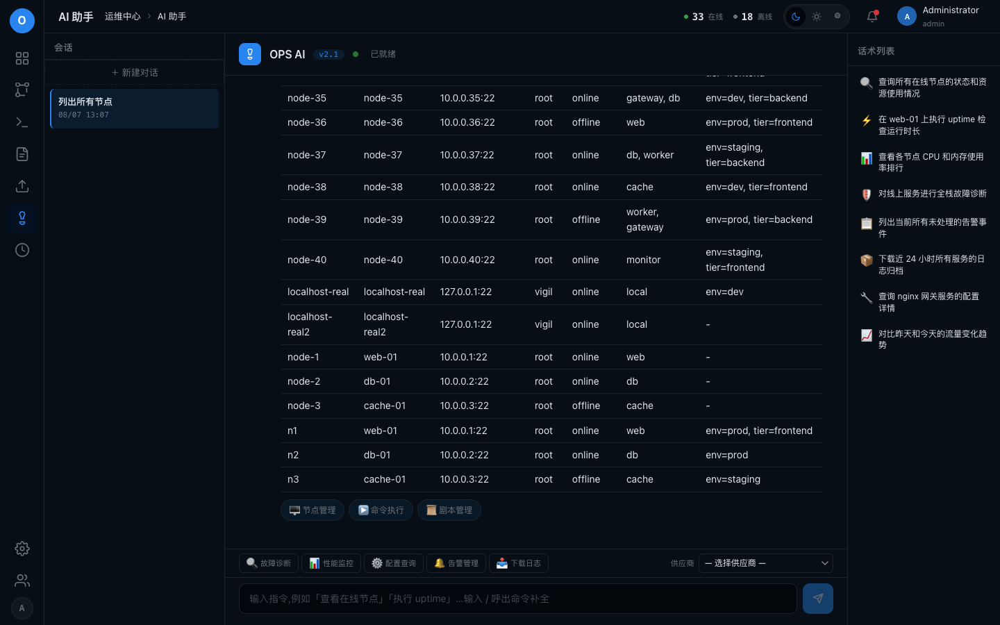

# feat-ai-chat_markdown-render-tool-results

## 问题

Web AI 对话里"列出所有节点"等工具结果是纯文本,能否通过 Markdown 表格渲染?并做查询/渲染层分离,补上 Groups/Labels 列。

## 环境

| 项 | 值 |
|----|----|
| git commit | 81eb368 |
| 分支 | feat/ui-redesign-phase0 |
| 平台 | darwin |
| 建档时间 | 2026-08-07T12:42:14+08:00 |
| 会话 | ses_028230b87ffeNVb393w4GItvl0 |

## 调查过程

- [12:42] 建档
- [12:48] 记录日志 (chat): 查询/渲染分离实现完成, 单测+marked 渲染验证通过; 真实 key 已失效无法做真 LLM E2E
- [13:07] 记录证据 1 项
- [13:07] 记录日志 (chat): 真实 LLM + 浏览器 E2E 通过: AI 对话节点列表渲染为 Markdown 表格
- [13:09] 结案

## 日志与摘录

### [chat] 2026-08-07T12:48:45+08:00 · 查询/渲染分离实现完成, 单测+marked 渲染验证通过; 真实 key 已失效无法做真 LLM E2E

```
实现: 查询/渲染层分离
- aiexecutor_data.go: nodeRow + queryNodeRows(ctx, group, status, search) 共享 SQL 层
- aiexecutor_render.go: mdCell(转义|)、formatLabelMap、renderNodeRowsMarkdown(GFM 表)、renderPlaybooksMarkdown、renderPlaybookInfoMarkdown 纯函数渲染层
- aiexecutor.go: QueryNodes/QueryDatabase/ListPlaybooks/PlaybookInfo 改为 data+render 组合; query_nodes/query_database 现在包含 Groups/Labels 列

验证:
- 单测: 6 个新测试(QueryNodes/QueryDatabase/ListPlaybooks/PlaybookInfo markdown 表 + 管道符转义 + 空结果)全绿; 全量 handler + internal/ai 全绿
- HTTP 全栈 mock 测试: TestChat_WithKey_RoutesThroughAgentQueryNodes 断言 reply 是 "| ID | Name | Address | User | Status | Groups | Labels |" 表
- 前端渲染: 用 web/js/marked.min.js 实测新输出 → <table><thead>...</table>, a\|b 正确转义渲染为 a|b

注意: 用户提供的 DeepSeek key sk-REDACTED(已从档案中删除/脱敏) 现已 401 失效(直接调 DeepSeek API 验证), 无法再做真实 LLM E2E。
```

### [chat] 2026-08-07T13:07:58+08:00 · 真实 LLM + 浏览器 E2E 通过: AI 对话节点列表渲染为 Markdown 表格

```
E2E 完成(真实 DeepSeek key sk-REDACTED(已从档案中删除/脱敏) + Playwright/系统 Chrome 操作真实 Web 界面):
1. curl 真实调用 /api/v1/ai/chat "列出所有节点" → reply 为 GFM 表(含 Groups/Labels 列, 47 个真实节点)
2. 同 session 追问 "列出在线的节点" → 只返回 online 节点表格(多轮正常)
3. 浏览器 E2E: 登录 → /ai → AIStorage 存 key → 发"列出所有节点" → 前端 marked 渲染出 .ai-msg-bubble table(表头 ID/NAME/ADDRESS/USER/STATUS/GROUPS/LABELS, 51 行), 截图归档 shots/001.png
4. 集成测试 TestChat_DeepSeek_Integration(env-gated) 用新 key 通过

备注: 期间发现旧 key sk-9b66...eacd 已失效(401), 用新 key 完成。
```

## 测试场景与 E2E 用例

| # | 用例 | 步骤 | 预期 | 结果 |
|---|------|------|------|------|

## 证据截图



## 修复方案

Web AI 对话工具结果从纯文本改为 Markdown 表格。aiexecutor 拆分为数据层(aiexecutor_data.go: nodeRow + queryNodeRows 共享 SQL)+渲染层(aiexecutor_render.go: mdCell 转义 / renderNodeRowsMarkdown / renderPlaybooksMarkdown / renderPlaybookInfoMarkdown 纯函数)。QueryNodes/QueryDatabase/ListPlaybooks/PlaybookInfo 走 data+render, 节点表格补上 Groups/Labels 列。前端零改动(marked gfm 已支持表格 + .ai-msg-bubble table 已有样式)。真实 DeepSeek key + Playwright/Chrome E2E: "列出所有节点" 在网页端渲染出 51 行真实 <table>。

## 复盘

纯文本工具结果之所以渲染不成表格, 不是前端缺渲染能力, 而是后端输出格式不是 GFM。查询与格式化耦合在同一函数也导致字段丢失(SQL 查了 groups/labels 却没展示)。教训: 数据层与渲染层分离, 从结构化行直接生成 markdown, 可保留全部字段且渲染器可替换。
