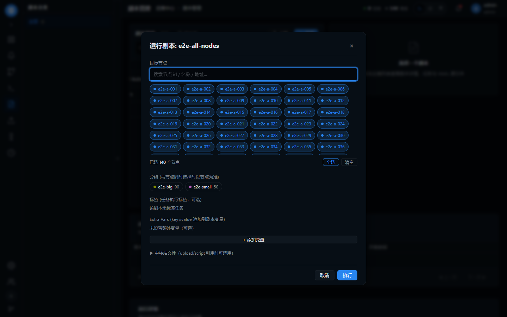

# feat-playbook_run-playbook-target-nodes-incomplete

## 问题

owl-serve 的前端里，为什么剧本管理，选择剧本，运行剧本，里的目标节点下面没有展示所有节点，只有部分节点，统计节点数也不正确

## 环境

| 项 | 值 |
|----|----|
| git commit | 68ce41c |
| 分支 | main |
| 平台 | win32 |
| 建档时间 | 2026-09-25T18:14:50+08:00 |
| 会话 | - |

## 调查过程

- [18:14] 建档
- [18:37] 记录日志 (bash): 根因证据: 不带 page_size 的 GET /nodes 只回 20 条(meta.total=140), 前端裸调即只拿到第一页
- [18:37] 新增 E2E 用例: 剧本管理→运行剧本: 目标节点全量展示与计数（140 节点）
- [18:37] 记录证据 1 项
- [18:37] 记录证据 1 项
- [18:37] 记录终端文本快照
- [18:37] 结案

## 日志与摘录

### [bash] 2026-09-25T18:37:33+08:00 · 根因证据: 不带 page_size 的 GET /nodes 只回 20 条(meta.total=140), 前端裸调即只拿到第一页

```
$ curl -s "http://127.0.0.1:18099/api/v1/nodes" -H "Authorization: Bearer $TOKEN"
-> data 长度 20 / meta: {"page":1,"page_size":20,"total":140}

handler/node.go:152
    pageSize, _ := strconv.Atoi(c.DefaultQuery("page_size", "20"))   // 默认 20
    if pageSize > 100 { pageSize = 100 }                             // 封顶 100
    query += " ORDER BY name LIMIT ? OFFSET ?"

修复前 playbooks.js:560
    const [nodesRes, filtersRes] = await Promise.all([api.nodes(), api.filters()]);
    runNodes = nodesRes.data || [];      // 只有前 20 个 → 目标节点不全 / 分组计数偏小

E2E 修复前后对比（140 节点，e2e-a-*(50) 名称排序在前、e2e-zbig-*(90) 在后）:
修复前: 种子/真值 OK: 节点 140, e2e-big 90, e2e-small 50
        FAIL: A: 目标节点应列 140 个，实际 20 个（只取了第一页？）
修复后: A PASS 目标节点 chips = 140
        B PASS 全选计数 = 140
        C PASS 分组徽标 e2e-big = 90 / e2e-small = 50
        D PASS 搜索过滤命中 = 90
        E PASS 提交 target_nodes = 140
        F PASS 告警调试节点下拉 = 140
        ALL PASS

Go 回归测试（修复前 FAIL → 修复后 ok）:
    --- FAIL: TestPlaybooksUI_RunTargetNodesLoadAll
        run dialog must not call api.nodes() bare (returns only the first page of 20)
    ok  github.com/cangyunye/go-owl/cmd/plugins/serve

全量包测试对比: git stash 前后失败集合完全一致（34 个，均为 Windows 下 t.TempDir 清理
owl.db 被占用 / monitor_api 既有断言，与本次改动无关）
```

## 测试场景与 E2E 用例

| # | 用例 | 步骤 | 预期 | 结果 |
|---|------|------|------|------|
| 1 | 剧本管理→运行剧本: 目标节点全量展示与计数（140 节点） | 1. 启动 owl-serve（OWL_DB_PATH 指向 test/e2e-owl.db，端口 18099） 2. 种子 140 个节点: e2e-a-001..050(组 e2e-small)、e2e-zbig-001..090(组 e2e-big)；建剧本 e2e-all-nodes 3. 剧本管理页点「运行」打开运行弹窗，等目标节点 chips 渲染完 4. 观察目标节点数量、点「全选」看已选数、看分组徽标计数 5. 搜索框输入 zbig 看过滤结果 6. 拦截 POST /playbooks/*/run，点「执行」看提交的 target_nodes 7. 告警页 → 监控配置 → 自定义类型「调试」弹窗看节点下拉选项数 脚本: test/e2e_issue11_playbook_run_all_nodes.py（Playwright headless） | 目标节点列全部 140 个；全选=140；分组徽标 e2e-big=90、e2e-small=50；搜索 zbig 命中 90；提交 target_nodes=140；告警调试下拉 140 个选项 | pass（A-F 全 PASS）；修复前 A 用例 FAIL：实际只列 20 个 |

## 证据截图



[文本快照: E2E 与回归测试输出快照（修复前/后对比）](shots/002-183736.txt)

## 修复方案

前端拿节点列表时只取了一页。GET /nodes 不带 page_size 时服务端默认回 20 条（上限 100），playbooks.js 运行弹窗的 loadRunTargetData() 裸调 api.nodes()，于是「目标节点」只列前 20 个、「全选」只选中这 20 个、分组徽标按这 20 个统计。

改动（commit 3f5712c）:
1. api.js 新增 nodesAll()：按 meta.total 翻页（page_size=100）取全量节点并返回数组；服务端钳制 page_size 或未返回 total 时，以「本页不满 page_size」作为最后一页的兜底判断。
2. playbooks.js 运行弹窗 loadRunTargetData() 改走 api.nodesAll()：目标节点 chips、全选、分组徽标计数从此都基于全量节点。
3. 同款缺陷一并修：alerts.js 告警调试弹窗节点下拉（原写死 page_size:100）、tasks.js 节点选择器（原 page_size:500 会被服务端钳到 100，其「节点总数」显示也随之偏小）。
4. 回归测试：playbooksui_test.go 增加 TestPlaybooksUI_RunTargetNodesLoadAll / TestNodePickers_LoadAllNodes，断言运行弹窗不得裸调 api.nodes() 且节点选择器必须走 nodesAll()；新增 test/e2e_issue11_playbook_run_all_nodes.py。

验证：140 节点（e2e-big 90 / e2e-small 50）下 Playwright E2E 修复前 A 用例 FAIL（只列 20 个），修复后 A-F 全 PASS —— 目标节点 140、全选 140、分组徽标 90/50、搜索 zbig 命中 90、拦截到的提交 target_nodes 140 个、告警调试下拉 140 个选项；serve 包测试与改动前对比失败集合完全一致（34 个 Windows 既有环境问题）。

## 复盘

根因：服务端分页默认值（20）对「选择器/统计」这类需要全量的消费方是隐性陷阱 —— 接口返回 200 且结构合法，前端不会报错，只是数据静默变少。项目里已经有 4 处（nodes/exec/files/dashboard）各自手写翻页循环，说明这不是第一次踩，而运行弹窗是漏网的第 5 处。

教训：
1. 「列表展示」用分页接口没问题，「选择器/计数/统计」必须显式拉全量；服务端 page_size 有上限（100）时，单次大 page_size 也不行（tasks.js 写 500 就是被钳到 100 的隐蔽 bug）。
2. 前端需要全量节点时应统一走一个 helper（本次落在 api.js nodesAll()），不要每个页面各写一遍循环；已经正确翻页的调用点后续可一并收敛。
3. 页面级「总数」「分组徽标」这类数字一旦由列表长度推导，就必须基于全量列表，否则数字会随第一页大小变化 —— dts/fix-dashboard_overview-node-count-wrong、test/e2e_issue5_group_counts.py 是同一模式的两次前例。
4. 翻页 helper 要防两种服务端行为：meta.total 缺失、page_size 被钳制，否则 helper 自己会「静默只取一页」。
