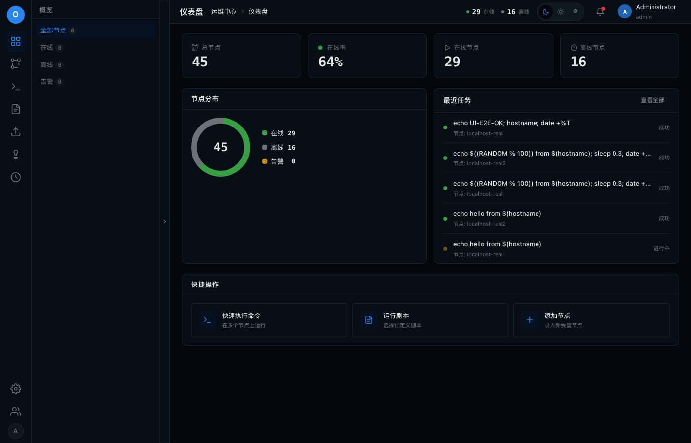

# fix-dashboard_overview-node-count-wrong

## 问题

serve概览总节点未统计:dashboard只取首页100条计数,顶栏在线/离线恒为0

## 环境

| 项 | 值 |
|----|----|
| git commit | 997d66e |
| 分支 | feat/ui-redesign-phase0 |
| 平台 | darwin |
| 建档时间 | 2026-08-06T17:59:44+08:00 |
| 会话 | ses_0297ff05effe01LgcYIPKVudMr |

## 调查过程

- [17:59] 建档
- [18:44] 记录证据 1 项
- [18:44] 记录日志 (chat): 概览统计根因与修复:改用 /nodes/stats 聚合接口
- [18:45] 结案

## 日志与摘录

### [chat] 2026-08-06T18:44:44+08:00 · 概览统计根因与修复:改用 /nodes/stats 聚合接口

```
根因:
1. dashboard.js loadAll() 用 api.nodes({page:1,page_size:100}) 的 data.length 当总节点数,忽略 meta.total(>100 节点失真);顶栏 statOnline/statOffline 无任何代码填充。
2. 修复:新增 GET /nodes/stats 聚合 total/online/offline/warn;dashboard 与 app.js loadTopbarStats() 均改用它。

E2E:seed 43+2=45 节点,概览 total=45 online=29 offline=16,顶栏同步显示 29/16。
```

## 测试场景与 E2E 用例

| # | 用例 | 步骤 | 预期 | 结果 |
|---|------|------|------|------|

## 证据截图



## 修复方案

新增 GET /nodes/stats(NodeHandler.Stats)以 SQL 聚合 total/online/offline/warn(offline 含 unknown、warn 含 warning),注册进 server.go reader 组;dashboard.js loadAll() 与 app.js loadTopbarStats() 改调该接口,顶栏在线/离线不再恒为 0。之前 dashboard 只取首页 data.length 当总数(忽略 meta.total),顶栏无任何填充。

## 复盘

前端统计必须用后端聚合结果或分页 meta.total,不能拿"当前页条数"当总数;带 UI 状态的面板数据要从单一数据源驱动。
