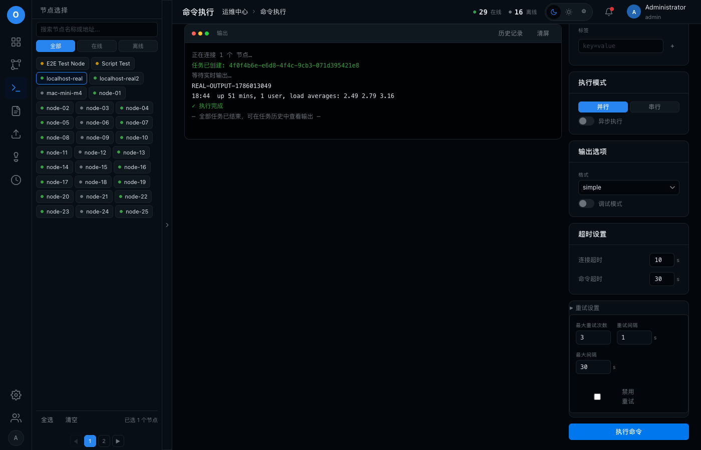

# fix-exec_exec-no-output-no-history

## 问题

运维中心命令执行可执行但看不到输出:后端不广播task_output,exec页不渲染WS流,历史详情不展示stdout/stderr

## 环境

| 项 | 值 |
|----|----|
| git commit | 997d66e |
| 分支 | feat/ui-redesign-phase0 |
| 平台 | darwin |
| 建档时间 | 2026-08-06T17:59:45+08:00 |
| 会话 | ses_0297ff05effe01LgcYIPKVudMr |

## 调查过程

- [17:59] 建档
- [18:44] 记录证据 1 项
- [18:44] 记录证据 1 项
- [18:44] 记录终端文本快照
- [18:44] 记录日志 (chat): 命令执行无输出/无历史根因与修复
- [18:45] 结案

## 日志与摘录

### [chat] 2026-08-06T18:44:46+08:00 · 命令执行无输出/无历史根因与修复

```
根因:
1. executeTask() 用阻塞式 Execute()(CombinedOutput),从不广播 task_output → exec 页终端无输出。
2. exec.js 仅单节点非异步开 WS;多节点/异步仅打印"已提交 N 个任务"。
3. history.js 详情只显示执行行,不渲染已入库的 stdout/stderr。

修复:
- executeTask 改用 ExecuteStream 逐行广播 task_output(WS),并限频(150ms)落库累积输出。
- WSHub 改为每客户端单写者 FIFO(sendCh),修复并发广播乱序。
- exec.js 任意模式统一开 WS 按 task_id 过滤渲染输出,多节点加 [node_id] 前缀,新增"历史记录"入口。
- history.js 详情以 <details> 展示每条执行的 stdout/stderr。
- 附带修复:sqlite PRAGMA 只作用于单个池化连接,并发写会 "database is locked" → DSN 注入 _busy_timeout/_journal_mode;终态落库加重试。

E2E:真实 SSH(localhost)流式输出逐行到达(含 stderr),多节点并行任务全部 completed,operation 状态完成。
```

## 测试场景与 E2E 用例

| # | 用例 | 步骤 | 预期 | 结果 |
|---|------|------|------|------|

## 证据截图



[文本快照: 真实 SSH 流式输出 E2E(WS 客户端观察)](shots/002-184438.txt)

## 修复方案

1) executeTask() 从阻塞 Execute() 改为 streamExecute():用 ExecuteStream 逐行广播 task_output(WS)并限频 150ms 落库累积输出,失败保留已流式输出+错误;2) WSHub 从"每消息每客户端起 goroutine 并发写"改为每客户端单写者 FIFO(sendCh),修复输出乱序;3) exec.js 任意执行模式统一开 WS 按 task_id 过滤渲染,多节点加 [node_id] 前缀,终端新增"历史记录"入口;4) history.js 详情以 <details> 渲染每条执行的 stdout/stderr;5) sqlite PRAGMA 仅作用于单个池化连接,并发流式落库触发 "database is locked" → 改 DSN 注入 _busy_timeout=5000&_journal_mode=WAL&_synchronous=NORMAL,终态落库 updateTaskStatus 加重试。

## 复盘

"能创建任务但看不到输出"的根因是后端根本不流式广播;逐行写库会放大 sqlite 锁竞争,实时性应由 WS 承担、DB 只限频落库。PRAGMA busy_timeout 必须走 DSN 才能覆盖连接池所有连接。
